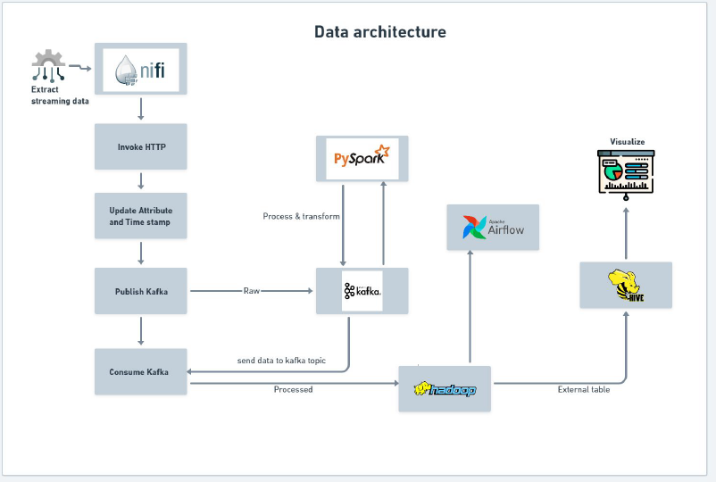

# DataPipeline-based-on-Messaging-using-Pyspark-and-Airflow

# Project Overview
This project involves straeming real-time data with Nifi, parse json to csv store in HDFS, process with Pyskark and Kafka, create Hive Table and deploy to datalake . Visualization with Tableau and AWS QuickSight for insights on data

# Aim
Aim of the project is to get insights on the ingested covid data 

# TechStack Used
    - Nifi
    - Kafka
    - PySpark
    - Hadoop
    - Airflow
    - Tableau
    - Docker
    - Amazon EC2

# Steps of Execution:
  1. Create AWS ec2 instance
  2. Install docker and docker-compose on ec2 instance
  3. Copy docker_exp to ec2 machine via scp or putty
  4. Make necessary permission changes
  5. Once inside the docker_exp , execute ./airflow.sh
  6. Execute docker-compose up to download images and run the docker comtainers
  7. Make necessary port forwarding for various running containers to access running services          on containers on local machine
  
# Approach
    1. Extract data from external source using API
    2. Process using Nifi
    3. Store the one set of raw result in HDFS
    4. Send the another set of raw data to Kafka for pre-processing using PySpark
    5. Processed data will be store in HDFS in another location
    6. Create an external hive table
    7. Cleaned transformed is stored in datalake
    8. Perform Visualization using Tableau

# Application Flow

    